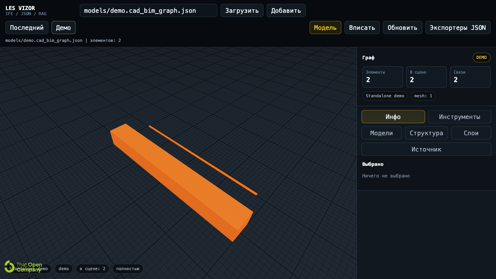

# BIM IFC Viewers

Русская коллекция BIM/IFC веб-вьюеров: **LES VIZOR**, **IFC.js Viewer**, **Xeokit App**, **Speckle Viewer** и обзорные страницы по openBIM-инструментам. Репозиторий нужен как исходник для сайта и как честная витрина разных подходов к просмотру IFC/BIM в браузере.

**Демо-сайт:** https://bim.ovc.me



## Вьюеры

| Вьюер | Демо | Путь в репозитории | Основная роль |
|---|---|---|---|
| **LES VIZOR** | https://bim.ovc.me/vizor/ | `vizor/` | Автономный WebGL-вьюер для IFC и CAD/BIM JSON |
| **IFC.js Viewer** | https://bim.ovc.me/webjs/ | `webjs/` | Классический браузерный IFC viewer на IFC.js/web-ifc-three |
| **Xeokit App** | https://bim.ovc.me/app/ | `app/` | Быстрый просмотр подготовленных BIM-моделей через Xeokit |
| **Speckle Viewer** | https://bim.ovc.me/speckle-viewer.php | `speckle-viewer.php` | Демо подхода Speckle: web viewer и облачный обмен BIM-данными |

## LES VIZOR

**LES VIZOR** - основной standalone-вьюер в этом репозитории. Он собран так, чтобы запускаться с обычного HTTP-хостинга без npm, backend-сервиса и приватного LES-контура.

Что умеет:

- открывает `.ifc`, `.ifczip` и `cad_bim_graph.json`;
- показывает несколько моделей в одной сцене;
- отображает слои, структуру, свойства выбранного объекта и статистику сцены;
- рендерит mesh, bbox, line, polyline, arc и text geometry;
- поддерживает fit, isolate, hide/show, сечения и простые замеры;
- работает как автономный статический пакет.

Когда полезен:

- нужен быстрый публичный просмотр IFC/CAD-BIM без установки desktop-софта;
- нужно показать результат LES/export pipeline в браузере;
- нужно хранить демо рядом с WASM, workers, sample IFC и JSON-моделями.

Ограничения:

- нужен WebGL и нормальный браузер;
- большие IFC зависят от памяти клиента и скорости парсинга `web-ifc`;
- приватные LES/RAG-интеграции в публичном standalone-пакете отключены.

Состав:

```text
vizor/
├── index.html
├── assets/index.js
├── assets/index.css
├── assets/worker-*.mjs
├── fragments/worker.mjs
├── web-ifc/*.wasm
├── models/demo.cad_bim_graph.json
├── ifc-sample/*.ifc
└── JSON/*.cad_bim_graph.json
```

## IFC.js Viewer

**IFC.js Viewer** - старое, но рабочее демо просмотра IFC через стек IFC.js / `web-ifc-three`. Это более прямой и понятный пример того, как IFC можно загружать и отображать в браузере.

Что умеет:

- загружает локальные `.ifc` модели из `webjs/models/`;
- показывает геометрию в Three.js-сцене;
- дает базовую работу с IFC-свойствами и просмотром модели;
- подходит как простая точка входа для экспериментов с IFC.js.

Когда полезен:

- нужно быстро понять механику IFC.js без тяжелой UI-обвязки;
- нужен простой пример для сравнения с VIZOR/OBC;
- важна читаемость демо, а не максимальная производительность.

Ограничения:

- UI и код legacy-уровня;
- меньше готовых BIM-инструментов, чем в VIZOR/OBC;
- для больших моделей может уступать специализированным пайплайнам.

## Xeokit App

**Xeokit App** - демо высокопроизводительного BIM-вьюера на Xeokit. Этот подход хорош, когда модель заранее подготовлена для web-просмотра и важны скорость, навигация и работа с крупными сценами.

Что умеет:

- открывает подготовленные BIM-данные для Xeokit;
- показывает дерево модели и навигацию по объектам;
- поддерживает быстрый web-viewer runtime;
- демонстрирует сценарий, где IFC обычно предварительно конвертируется в web-friendly формат.

Когда полезен:

- нужны большие модели и быстрый просмотр;
- можно построить отдельный pipeline подготовки данных;
- нужно сравнить runtime-вьюер с прямым парсингом IFC в браузере.

Ограничения:

- обычно требуется предварительная конвертация модели;
- это не самый простой путь для "просто открыл IFC и посмотрел";
- структура демо частично legacy, сохранена как рабочий пример.

## Speckle Viewer

**Speckle Viewer** - демо подхода, где BIM-данные живут не только как локальный файл, а как поток/модель в экосистеме Speckle. Это ближе к совместной работе, версиям и обмену между инструментами.

Что умеет:

- показывает Speckle-oriented web viewer сценарий;
- демонстрирует идею облачного обмена BIM-данными;
- полезен как контраст к полностью локальным viewer-подходам;
- связан с обзорной страницей Speckle на сайте.

Когда полезен:

- важны совместная работа и обмен между BIM-инструментами;
- нужно показать viewer не как файловую утилиту, а как часть data platform;
- хочется сравнить local-first и cloud/data-platform подходы.

Ограничения:

- зависит от Speckle-источника данных и сетевого сценария;
- не является полностью offline/local viewer;
- для приватных моделей нужны корректные права доступа в Speckle.

## Обзорные Страницы

На сайте есть не только демо, но и русские обзорные страницы по технологиям:

| Страница | URL | Назначение |
|---|---|---|
| IFC.js | https://bim.ovc.me/ifcjs.php | Что такое IFC.js и где он уместен |
| OBC | https://bim.ovc.me/obc.php | That Open / OpenBIM Components и модульный BIM UI |
| Xeokit | https://bim.ovc.me/xeokit.php | Производительный web-viewer подход |
| Speckle | https://bim.ovc.me/speckle.php | Обмен BIM-данными, версии и collaboration |

## Быстрый Локальный Запуск

Из корня репозитория:

```bash
python3 -m http.server 8095
```

Открыть VIZOR:

```text
http://127.0.0.1:8095/vizor/
```

Открыть минимальный JSON demo:

```text
http://127.0.0.1:8095/vizor/?source=models/demo.cad_bim_graph.json
```

Открыть IFC sample через верхнее поле VIZOR:

```text
ifc-sample/Building-Hvac.ifc
```

Важно: не открывайте `vizor/index.html` двойным кликом из файловой системы. Браузер может заблокировать WASM и workers. Нужен любой локальный или удаленный HTTP server.

## Деплой На Сайт

Репозиторий рассчитан на обычный shared hosting / Apache. Нужно загрузить содержимое репозитория в корень сайта `bim.ovc.me`.

В `.htaccess` уже добавлены MIME-типы для BIM runtime:

```apache
AddType application/wasm .wasm
AddType text/javascript .mjs
AddType application/javascript .js
AddType application/json .json
AddType application/octet-stream .ifc .ifczip
```

Карточки главной страницы сайта лежат в `config/bim_layout.json`. Сейчас там отдельно указаны теория и практика: VIZOR, IFC.js Viewer, Xeokit App и Speckle Viewer.

## Структура Репозитория

```text
bim-ifc-viewers/
├── vizor/                 # LES VIZOR, автономный вьюер
├── webjs/                 # IFC.js / web-ifc-three demo
├── app/                   # Xeokit viewer build and data
├── config/bim_layout.json # Карточки сайта bim.ovc.me
├── *.php                  # Shared-hosting страницы и навигация
├── docs/assets/           # Скриншоты для GitHub README
└── frontend/ui-kit/       # Legacy UI-kit для сайта
```

## Сравнение Подходов

| Подход | Сильная сторона | Ограничение |
|---|---|---|
| VIZOR / OBC | Standalone runtime, IFC + CAD/BIM JSON, удобная сцена | Бандл крупный, нужен WebGL |
| IFC.js | Простая классика для экспериментов с IFC в браузере | Меньше готовой UI-обвязки |
| Xeokit | Быстрый просмотр подготовленных BIM-моделей | Обычно нужна конвертация в web-friendly формат |
| Speckle | Совместная работа и облачный обмен BIM-данными | Не полностью offline/local viewer |

## Технологии

- That Open Components `3.4.x`
- Three.js `0.184.0`
- web-ifc `0.0.77`
- IFC.js / web-ifc-three
- Xeokit BIM Viewer
- Speckle Viewer
- PHP/shared-hosting навигация сайта

## Лицензия

MIT.
